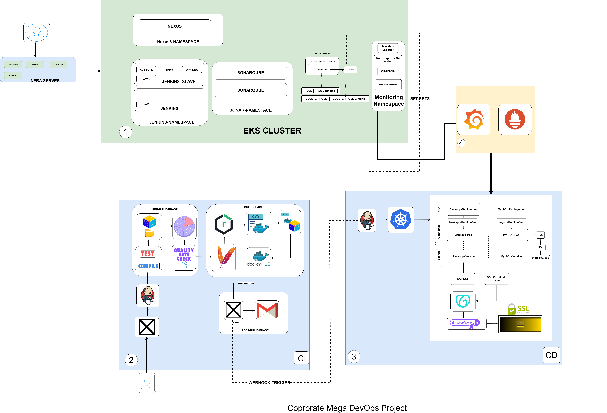

                        Corporate Bank App Mega Devops Project

Overview
This repository contains the Continuous Deployment (CD) pipeline configuration and Kubernetes manifests for the Corporate Mega DevOps Project. The CD pipeline uses Jenkins to deploy the BankApp application and MySQL database to Amazon EKS (Elastic Kubernetes Service) cluster with automated SSL certificate management, horizontal pod autoscaling, and comprehensive monitoring.

Terraform Repository for EKS Infrastructure
The AWS infrastructure for this project (EKS cluster, VPC, networking, IAM roles, etc.) is provisioned and managed using Terraform in a separate dedicated repository.
Repository: [MEGA-PROJECT-TERRAFORM-Tool ](https://github.com/kelvinSeamount/MEGA-PROJECT-TERRAFORM-Tool)

Architecture Components

Amazon EKS Cluster

    Cluster Name: mekadevops-cluster
    Region: eu-central-1
    Control Plane: Managed Kubernetes control plane
    Worker Nodes: Auto-scaling node groups for application workloads
    Namespace: webapps (primary application namespace)

Jenkins CD Pipeline

    Automated deployment from Git repository
    Direct kubectl commands for resource deployment
    Kubernetes credential management via Jenkins
    Post-deployment verification and health checks